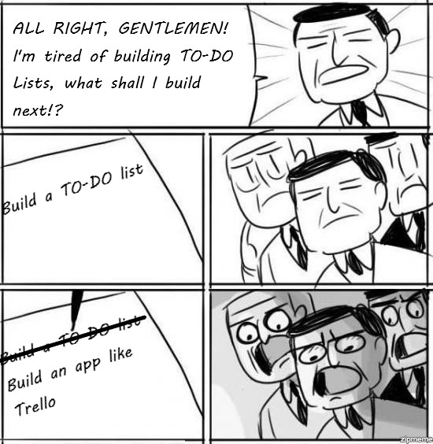

# Ultimate-Kanban

A more complex version of all the Kanban exercises I have done.
For now it doesn't have a backend and is hosted with Github Pages. It saves data in your local storage.

### Dependencies:

- react
- react-router
- react-dnd
- redux
- semantic-ui-react
